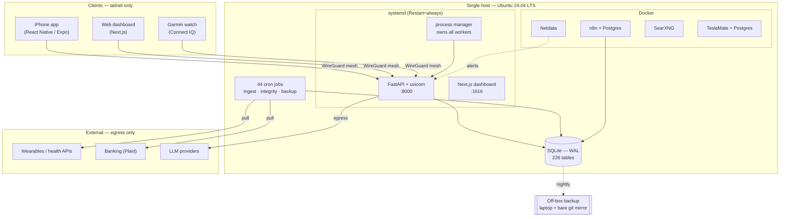

# HAVEN — Architecture

HAVEN is a self-hosted personal AI system: an always-on service that ingests data
from wearables, banks, calendars and messages, keeps its own records, and surfaces
what matters without being asked. It runs on hardware I own, on a private network,
with no inbound path to the application from the public internet.

This repository documents **how it is built and operated**. It is not the source
tree — the application code stays private. What is here is the infrastructure
story: the machine, the network, the storage and backup design, process
supervision, monitoring, and a real incident log.

I publish this because the interesting part of HAVEN is not the AI. It is that a
2016 consumer laptop with 11 GB of RAM and no GPU has served a production
workload for **147 days without a restart**, and that when it does break, there is
a documented path back.

---

## The system at a glance

| | |
|---|---|
| **Host** | 2016-era consumer laptop, AMD A12-9720P (2 cores / 4 threads, 2.7 GHz), 11 GiB RAM, no GPU |
| **OS** | Ubuntu Server 24.04.4 LTS, kernel 6.8 |
| **Storage** | Single 931 GB SATA SSD, ext4, 9% used |
| **Uptime** | 147 days at time of writing |
| **Network** | WireGuard mesh (Tailscale); no port forwarding, no public ingress to the API |
| **Datastore** | SQLite in WAL mode — 39 MB, 226 tables |
| **Backend** | Python 3 / FastAPI under systemd, ~104k lines across 404 modules |
| **Containers** | 7 Docker services (automation, metrics, search, vehicle telemetry) |
| **Scheduled work** | 44 cron entries |
| **Tests** | 30 suites, run with plain `python3` — no test runner installed on the box |

## Architecture

## Documentation

| Doc | What it covers |
|---|---|
| [Compute](docs/compute.md) | The hardware, why it is deliberately weak, and the capacity rules that follow |
| [Networking](docs/networking.md) | Mesh VPN, interface-binding discipline, what is and is not reachable |
| [Storage & backup](docs/storage-and-backup.md) | SQLite WAL, the 3-layer backup topology, the single-disk tradeoff, restore drill |
| [Services & supervision](docs/services-and-supervision.md) | systemd, the process manager, why workers are never started by hand |
| [Observability](docs/observability.md) | Metrics, edge-triggered alerting, and integrity checks that must be able to fail |
| [Operations](docs/operations.md) | The runbook: restarts, log locations, diagnosis order |
| [Incidents](docs/incidents.md) | Real postmortems, with root causes and the rules they produced |
| [AI-assisted development](docs/ai-assisted-development.md) | How this is actually built, and the guardrails that make it safe |

## Design constraints

Four rules do most of the architectural work:

1. **The hardware is fixed and weak.** No GPU, 11 GB of RAM, a CPU from 2016.
   Every new component has to justify its resident memory. Heavy compute is
   refused, not scheduled — see [compute](docs/compute.md).
2. **Nothing is exposed to the internet.** Clients reach the system over a
   WireGuard mesh. There is no reverse proxy on a public IP, no port forwarding
   to the API, no inbound path from outside the tailnet.
3. **It must be maintainable by one person.** Small modules, boring names, few
   dependencies. If a subsystem cannot be understood in one sitting six months
   later, it is the wrong design.
4. **A check that cannot fail is not a check.** Every integrity check ships with
   a test that reintroduces the original bug and asserts the check goes red.
   This is enforced, and it has caught bad checks of mine — see
   [observability](docs/observability.md).

## What this is not

- Not a product, not multi-tenant, not for sale. One user.
- Not a Kubernetes deployment. One host, systemd, and Docker where a container
  is genuinely simpler than a package.
- Not highly available. It is a single machine, and the design says so honestly
  rather than pretending otherwise. What it has instead is a fast, tested path
  back — see [storage & backup](docs/storage-and-backup.md).
